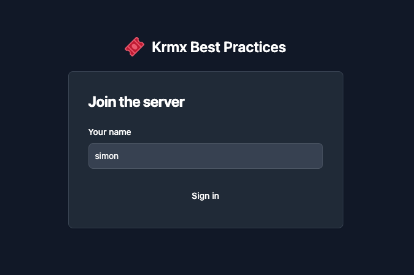

# 🎟️ Krmx Best Practices
If you've used Krmx before you know it can be tedious to manually sync state on server and client-side. To circumvent these issues, this mono repo sets up a [Krmx](https://simonkarman.github.io/krmx) server and client using a **System** architecture.

A **System** is a shared state store with predefined actions that uniformly alter that state on the server and clients. The clients use optimistic updates to give immediate feedback to the user.

## Features
If you've used Krmx before you know it can be tedious to manually sync state on server and client-side.
- Uniform state management
- Optimistic updates at the Client-Side
- Utilize React ContextAPI to get the state
- Keep track of history to seamlessly let new clients join
- Use batches of events to stream history to clients
- Restore server state on restart by replaying history

## Getting started
First run `npm install` in the root of this repository.

Then, run `npm run dev` to start the system, server and client in development mode.
